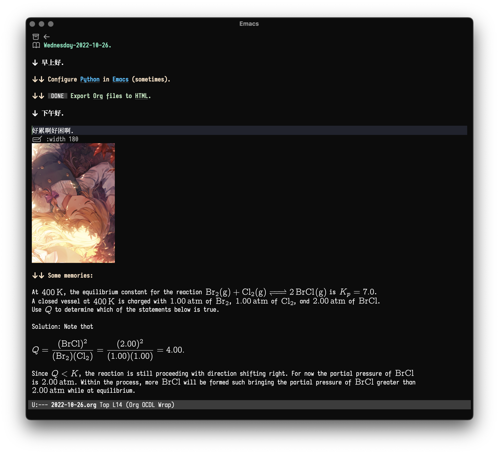

==============================================
Create Editing Tool For Researchers with Emacs
==============================================

Introduction
============

This page introduces Emacs (a text editor),
and a brief overview of the implementation of the features mentioned in the following text.

Core Features
=============

- Efficient text editing, which includes mathematically efficient entry based on LaTeX.
- Complete preview system: you can always preview the compiled content written in plain text.
- Database storage: The contents of your notes are stored in SQLite, This allows you to quickly retrieve the content of your notes.
- Cardbox (ZettelKasten) system: Your recorded knowledge is connected to each other, allows you to examine the relationships between knowledge.
- Emacs-based implementation of custom functions: You can highly customize your workspace, and add the functions you want.

For Researchers
===============

All text is based on the format provided by `Org-mode <https://orgmode.org>`__,
It contains a text markup language that allows you to write rich text in the file. In the case of academic paper typesetting,
LaTeX is one of the most standardized tools for typesetting academic papers. But it is not easy to master LaTeX, its
Its basic rules are complex, and you can see only the source code while writing LaTeX files.
To preview the current document, you have to compile the entire document using the engines pdfTeX or XeTeX - and the whole process is time-consuming.
and the whole process is very time-consuming.

Now I'll tell you a very good thing: in Emacs, we can preview the
LaTeX content in pieces, and get a very good layout right in the source code -- which means you can use
Emacs as a front-end for your notes. In fact, Emacs is highly compatible with LaTeX,
This may have something to do with its history: LaTeX's predecessor, the TeX typesetting system, was written by Donald E. Knuth
LaTeX's predecessor, TeX, was written by Donald E. Knuth, who once said that his favorite software was Emacs.

In Emacs there are already quite sophisticated tools for writing papers. For example, AUCTeX,
which provides the ability to format and preview LaTeX mathematically. CDLaTeX, on the other hand, provides a series of functions for simplifying
CDLaTeX provides a series of functions and templates to simplify LaTeX entry. In Org-mode, the ``ox-latex.el`` package provides functions for making
``.org`` files to LaTeX files.

Demo Picture
============

Preliminary Usage
=================

Installation
------------

Prerequisites
~~~~~~~~~~~~~

-  Emacs 29 (You may compile from source).
-  ripgrep (rg) executable in ``PATH``.
-  LaTeX executable in ``PATH``.
-  PumpinJunkies Font (optional): Download it at
   `ilyaw39/PumpinJunkies <https://github.com/ilyaw39/PumpinJunkies>`__ then install it.

Using the Emacs Config
~~~~~~~~~~~~~~~~~~~~~~

``git clone https://github.com/ilyaw39/.emacs.d.git``

Users' Manual
-------------

Once the Emacs configuration has been initialized, you will see today's daily note provided by `Org Roam <https://github.com/org-roam/org-roam>`__.
This design mechanism is inspired by `Roam Research <https://roamresearch.com>`__.

Cheat Sheet
-----------

=========== ===============================
Key         Function Called                
=========== ===============================
``C-c n j`` ``org-roam-dailies-goto-today``
``C-c n i`` ``org-roam-node-insert``       
``C-c n f`` ``org-roam-node-find``         
``C-c n a`` ``org-roam-alias-add``         
``C-c n l`` ``org-roam-buffer-toggle``     
=========== ===============================
